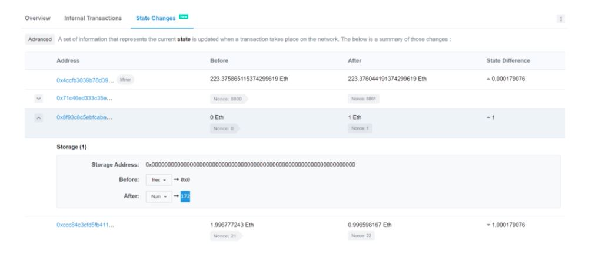

# Guess the random number

```
pragma solidity ^0.4.21;

contract GuessTheRandomNumberChallenge {
  uint8 answer;

  function GuessTheRandomNumberChallenge() public payable {
    require(msg.value == 1 ether);
    answer = uint8(keccak256(block.blockhash(block.number - 1), now));
  }

  function isComplete() public view returns (bool) {
    return address(this).balance == 0;
  }

  function guess(uint8 n) public payable {
    require(msg.value == 1 ether);

    if (n == answer) {
      msg.sender.transfer(2 ether);
    }
  }
}
```

## Goal

Guess the number to win and get all the ETH from the smart contract

## Exploit

The way we can win this CTF is to look into the transaction that has deployed the GuessTheRandomNumberChallenge contract. For that case we can use Etherscan.

In Etherscan we can go to the "State Changes" part of the transaction and search for the state change that changes the contract ETH balance from 0 to 1.

We check this change because the contract gets 1 Ether inside the constructor and here is also where the answer variable is assigned a value.

Inside here we can find the value of the answer variable.




